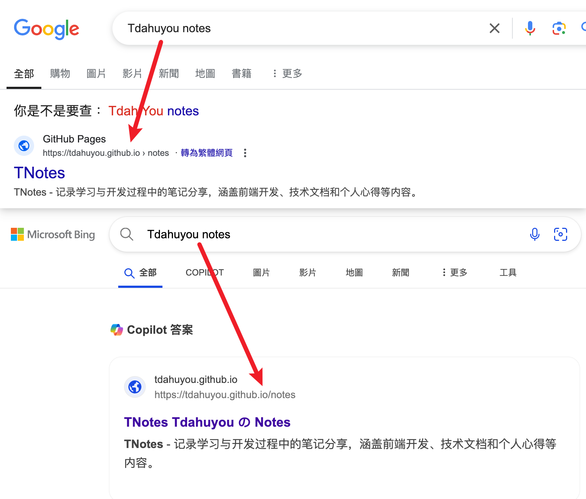

# 📒 TNotes

## TNotes 是什么？

::: tip TNotes 简介
- TNotes 全称 👉 Tdahuyou の Notes
  - 对 `Google Chrome` 和 `Microsoft Bing` 的搜索做了 `SEO` 优化，你可以通过用户名 `Tdahuyou` ➕ `notes` 👉 `Tdahuyou notes` 快速搜到该站点。
  - 
- TNotes 是一个基于开源项目和免费工具（比如：[github pages](https://pages.github.com/)、[vitepress](https://vitepress.dev/)、[giscus](https://giscus.app/zh-CN)、[markdown-it](https://github.com/markdown-it/markdown-it) ……）搭建的个人笔记平台，有点儿像是一个“个人的在线知识库”。
- TNotes 中汇总了个人写的一些笔记内容，以便满足查阅和分享的需求。但凡是在 TNotes 中能看到的内容，均已开源在 [github](https://github.com/Tdahuyou) 上。
- TNotes 诞生时间：`24.08.28`
- 主题：推荐使用暗色 `dark` 主题。
  - 在编写内容的时候，默认使用的就是 dark 模式来写的，有些内容在 light 模式下预览效果可能并不好。
:::

::: details 🤔 问：目前 TNotes 中都打算记录哪些内容？
- TNotes 主要用来汇总个人写的一些学习笔记。
- 除了学习笔记之外，也会记录一些其他乱七八糟的内容，比如：
  - 随笔
  - 做饭
  - 个人动态
  - 阅读过的书籍
  - 看过的电影
  - 追过的番
  - 自己写的一些开源项目
  - ... 等等
- **目前（25）正在逐步搬运个人的学习笔记到 TNotes 中。**
  - 已完成搬运的，会在对应的笔记标题前边 ✅ 打勾。
:::

::: details TNotes logo 介绍

> - 这是大二 `👣 7291 | 2019-06-14 16:52` 去学校附近的海边拍的脚印，是第一条朋友圈发的图，也是朋友圈的封面，就暂且拿它来做 TNotes 的 logo 吧。
> - 你可以在 TNotes 中记录的我的 2019 年的动态中看到那条朋友圈。
:::