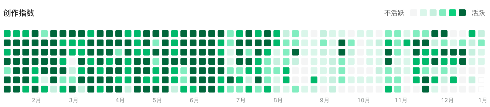
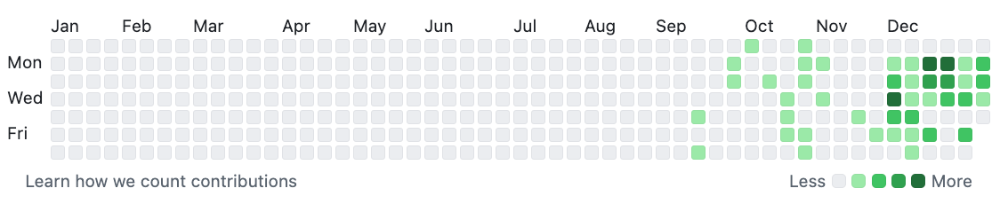

# ✍️ 创 作

- **创作指数**
  - 基本上每天都会写点儿东西，可见 [yuque](https://github.com/Tdahuyou)、[github](https://github.com/Tdahuyou) 底部的创作指数。
    - 
    - 
    - 从 24.08 开始逐步搬运 yuque 上的内容到 github 上。
- **创作流程**
  1. 输入 - 找资料学习，会在分享的文章中记录相关资料的链接。
  2. 输出 - 写文档，如果是技术类文章还会写 demos。
  3. 分享 - 录视频，认同费曼学习法，会尝试通过讲解的方式来辅助自己理解知识点。
- **不定期更新**
  - 闲：周更；忙：月更/年更。
  - 每篇文档基本上都加了更新时间标注，你可以看到内容更新的具体时间。
- **所见即所得**
  - **但凡你能看到的内容，都可以一键复制，或直接 git clone xxx 克隆整个仓库。**
    - **如需搬运，烦请标明出处。**
  - 尤其对于技术分享中分享的内容，每个知识点都有对应的 Git 仓库链接，可直接 git clone 获取该知识点下所有的源码。也许这些 demos 也能够让你快速了解相关的知识点，通过修改 demos 中的源码，加以验证自己对技术的理解是否正确。