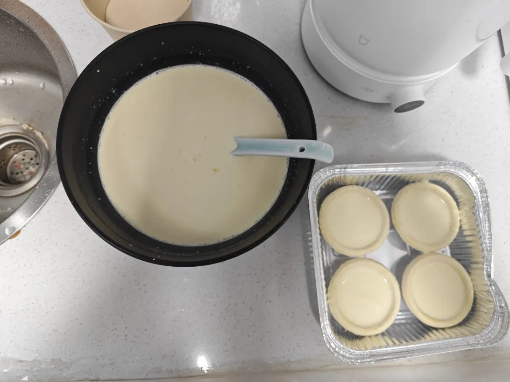
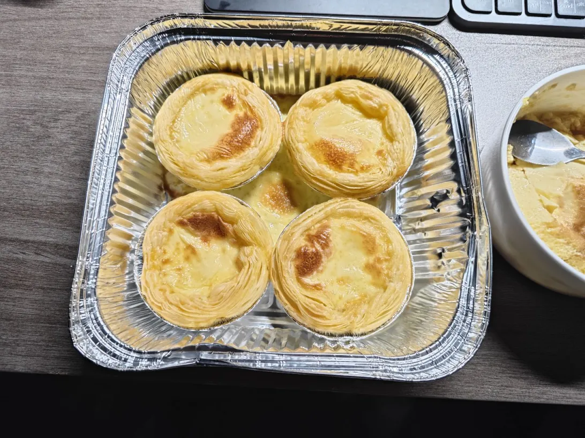

# 😋 蛋挞

- 20min+
- 蛋挞皮事前准备好，蛋挞液自己配。
- 自己配蛋挞液：
- 牛奶：250ml
- 淡奶油：250ml
- 炼乳：20g
- 白砂糖：凭感觉加
  - 成品甜了，下次少加。
  - 成品淡了，下次多加。
- 流程：
  1. 配置好蛋挞液倒入蛋挞皮中（盛满一半多点儿就够了，否则太容易溢出了。）
  2. 直接丢空气炸锅 200℃ 等 15min 即可。
- 
  - 自己调的蛋挞液 - 24.05.03
- 
  - 成品 - 24.05.03（这一份的口感有些偏淡，然后多加了一些白沙糖，第二份好吃多了～）
