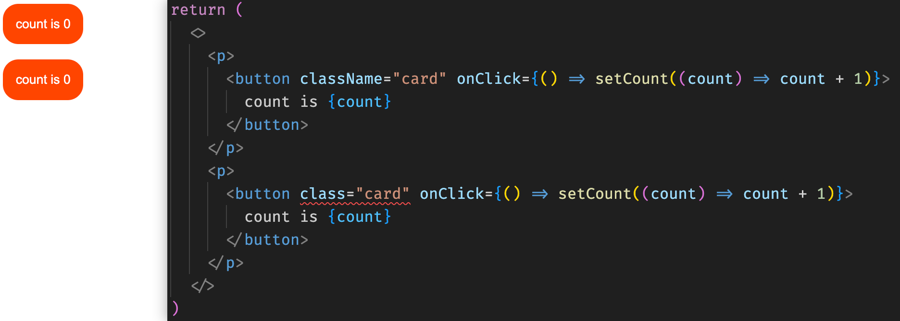
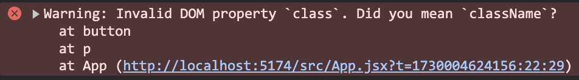
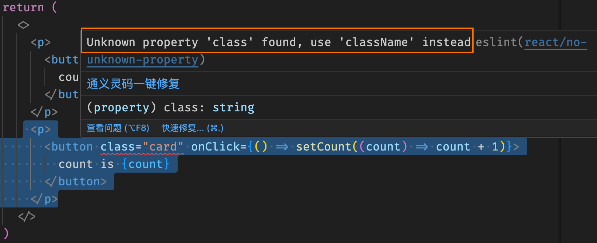

# [0004. 使用 className 给元素添加 class](https://github.com/Tdahuyou/react/tree/main/0004.%20%E4%BD%BF%E7%94%A8%20className%20%E7%BB%99%E5%85%83%E7%B4%A0%E6%B7%BB%E5%8A%A0%20class)

<!-- region:toc -->
- [1. 🔗 react 官网 - adding-styles](#1--react-官网---adding-styles)
- [2. 📒 使用 className 来指定一个 CSS 的 class 的语法](#2--使用-classname-来指定一个-css-的-class-的语法)
- [3. 🤔 为什么不直接使用 class 来添加样式，而是使用 className 呢？](#3--为什么不直接使用-class-来添加样式而是使用-classname-呢)
- [4. 💻 demo - className 基本使用](#4--demo---classname-基本使用)
<!-- endregion:toc -->
- 在 React 中，我们通过使用 JSX 语法来定义组件模板，在组件模板中，我们可以使用 className 来指定一个 CSS 的 class。
  - ✅ ``
  - ❌ ``

## 1. 🔗 react 官网 - adding-styles

- https://zh-hans.react.dev/learn#adding-styles

## 2. 📒 使用 className 来指定一个 CSS 的 class 的语法

在 React 中，你可以使用 className 来指定一个 CSS 的 class。它与 HTML 的 class 属性的工作方式相同：

```html

```

然后，你可以在一个单独的 CSS 文件中为它编写 CSS 规则：

```css
/* In your CSS */
.avatar {
  border-radius: 50%;
}
```

React 并没有规定你如何添加 CSS 文件。最简单的方式是使用 HTML 的 `<link>` 标签。如果你使用了构建工具或框架，请阅读其文档来了解如何将 CSS 文件添加到你的项目中。

## 3. 🤔 为什么不直接使用 class 来添加样式，而是使用 className 呢？

- 在 React 中，**为了与 JSX 中的 class 关键字区分**，推荐使用 className 来添加 CSS 类名，尽管在某些情况下直接使用 class 也可能正常工作，但这是不规范的做法且可能引发问题。
- 虽然在一些环境中直接使用 class 属性可能会被编译器正确处理并渲染出来，这可能是因为现代的构建工具（如 Create React App、Vite）和转译器（如 Babel）能够识别并转换这些属性。但是，根据官方文档以及最佳实践，你应该始终使用 className 来指定元素的 CSS 类。这样可以确保代码的一致性和未来的兼容性，并避免潜在的错误或混淆。

## 4. 💻 demo - className 基本使用

```css
/* test.css */
.card {
  outline: none;
  border: none;
  padding: 1em;
  border-radius: 1rem;
  background-color: #f40;
  color: #fff;
  text-align: center;
  cursor: pointer;
}
```

```jsx
import { StrictMode } from 'react'
import { createRoot } from 'react-dom/client'
import { useState } from 'react'

// 引入 css
import './test.css'

function App() {
  const [count, setCount] = useState(0)

  return (
    <>
      <p>
        <button className="card" onClick={() => setCount((count) => count + 1)}>
          count is {count}
        </button>
      </p>

      {/* ❌ 错误写法 */}
      {/* 但是渲染结果是正常的。 */}
      {/* <p>
        <button class="card" onClick={() => setCount((count) => count + 1)}>
          count is {count}
        </button>
      </p> */}
    </>
  )
}

createRoot(document.getElementById('root')).render(
  <StrictMode>
    <App />
  </StrictMode>,
)
```

- 如果直接写 class 的话，在本节的 demo 中测试结果是可以正常渲染出来的。但是需要知道这种写法其实是错误的，eslint 和 react 内部都会抛出错误提示。
  - 最终渲染结果：
    - 
  - react 报错：
    - 
  - eslint 报错：
    - 
  - 这些错误提示都是在提醒我们，直接使用 class 的写法在 react 的 jsx 中给元素添加样式的行为是不正确的。


