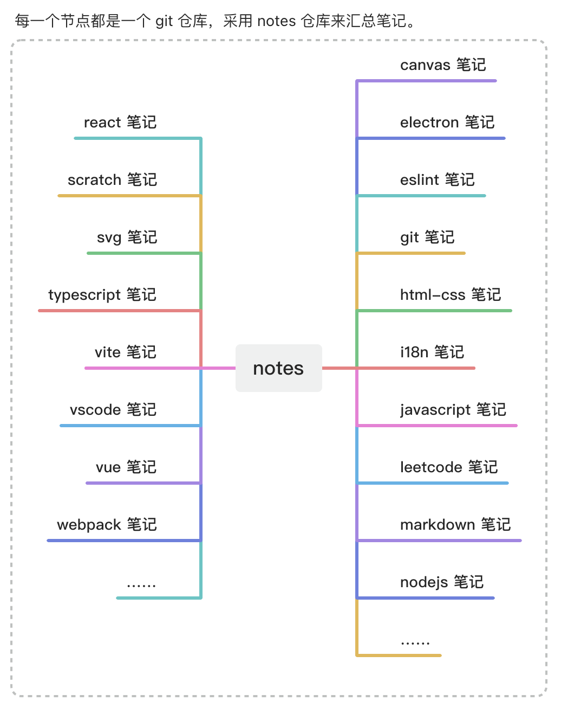

# 🔨 TNotes 基本架构



- 笔记目录结构：

```bash
├── notes # 管理其他笔记
├── canvas
├── electron
├── en-notes
├── eslint
├── git
├── html-css
├── i18n
├── javascript
├── leetcode
├── markdown
├── miniprogram-wechat
├── nodejs
├── react
├── vue
├── vite
├── webpack
├── ……
```

- **🤔 为什么要分仓库来管理笔记？**
- **体积问题**：若所有笔记都统一丢到一个仓库中，后续仓库体积可能会变得异常庞大。
- **划分原则**：仓库的划分可能有些是不太合理的，会根据实际情况不断调整优化。
  - 比如 markdown、mermaid 的笔记，从某种程度上讲，mermaid 的笔记其实可以一并丢到 markdown 中，因为 mermaid 的主要应用场景基本上都是在 markdown 中使用。
  - 这也是一个不断学习的过程，在学习某个内容 xxx 的时候，最初做的划分很可能也都是不太合理的，后续再优化结构即可，初学阶段没必要过分纠结自己写的笔记应该属于哪个组，重要的是先把笔记给写好。