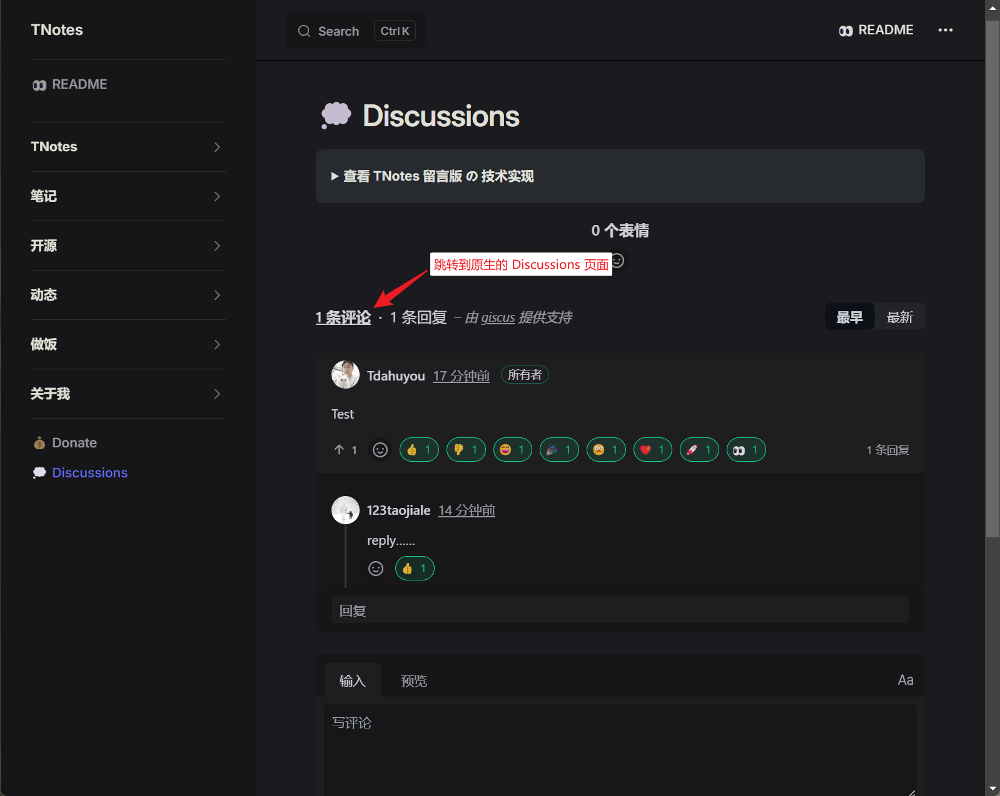
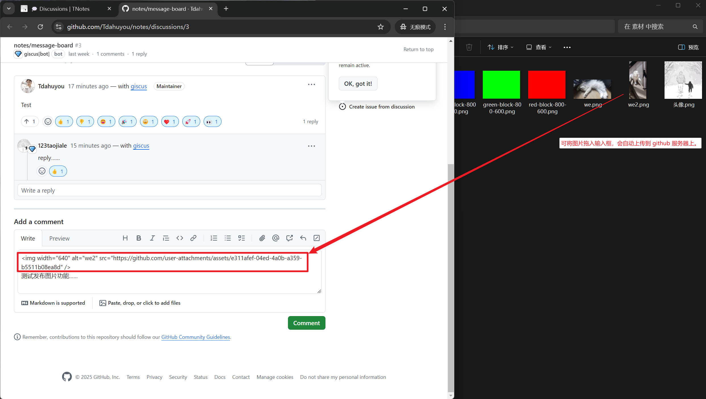

# 💭 TNotes 评论模块（Discussions）的技术实现

- 评论功能是基于 [Giscus](https://giscus.app/zh-CN) 实现的。
- Giscus 是基于 GitHub Discussions 的评论系统。
- 用户通过 GitHub 登录后可以发表评论，评论会同步到你指定的 GitHub Discussion 中。
- 优点：
  - 免费，易于集成。
  - 评论内容存储在 GitHub 对应仓库的 Discussions 中，不需要服务器。
  - 支持 Markdown，SEO 友好。
- 缺点：
  - 发布评论的前提是得有 GitHub 账号。
  - Giscus 提供的输入框不支持直接上传附件，如果要上传图片等 `📎附件资源` 需要通过原生的 Discusstions 来发。
    - 
    - 
    - 在发布图片的时候，如果已经有了图片的超链接地址，那么可以直接采用 markdown 语法来发布。
- 集成步骤：
  1. 前往 [Giscus](https://giscus.app/) 配置页面。
  2. 填入你的 GitHub 仓库信息，选择是否使用 Discussions。
  3. 根据配置生成一段代码，将其添加到 VitePress 的 `themeConfig` 或自定义组件中。
  4. 发布后即可启用评论。